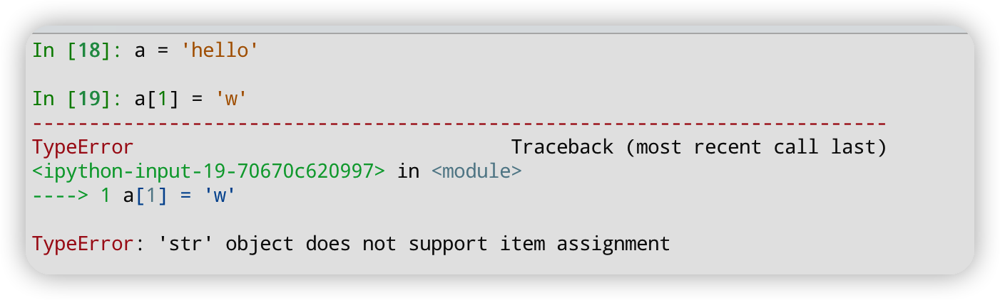

- # [[python]] 数据类型
	- python 中有几种基本的数据类型：
		- 数字
		- 字符串
		- 列表
		- 元组
		- 集合
		- 字典
	- ## 数字
		- **不可变对象**
		- 在数字中，python 支持 int（长整型）、bool、complex、float 四种数据类型，python2使用 Long 表示长整型。
		  `/` 计算得出的是浮点数，`//` 执行整除
		- 
	- ## 字符串
	  collapsed:: true
		- **可变对象**
		- `'...'` 和 `"..."`所表示的东西相同。如果你的字符串中携带了 `'`，那么你可以使用`"..."`。
		- 如果你不想字符串中的内容被转义，可以使用`r'...'` 或者 `r"..."`：
			- 
		- 多行字符串使用`"""...."""` 或者 `'''...'''` 的方式，在每行末尾加一个 `\` 可以去除行尾的换行符。
		- 字符串可以使用 `*` 进行重复。
			- {:height 205, :width 685}
		- 相邻的两个或多个 _字符串字面值_ （引号标注的字符）会自动合并。(如果存在表达式则是不行的)
		  collapsed:: true
			- 
		- 字符串是不可变的，对某个位置的字符进行修改会报错。
			- 
		-
	- ## 列表
		- **可变对象**
		- python 中最常用的数据结构。它支持正索引和负索引、列表切片等操作。使用 `+` 可以将两个列表合并成一个。
	- ## 集合
		- **可变对象**
			- 存储一组不重复的元素，集合支持很多种操作：
			- `1 in a` 用来判断一个元素是否在集合中。
			- `a - b` 表示 a 和 b 的差集。
			- `a | b` 表示 a 和 b 的并集。
			- `a & b` 表示 a 和 b 的交集
			- `a ^ b` 表示 a 和 b 中不同时存在的元素。
	- ## 字典
		- **可变对象**
		- 最常用的数据结构，底层是使用数组或者红黑树等数据结构存储。
- # [[python]] 可变对象和不可变对象
	- **函数参数传递都是通过引用的方式进行传递。**
	- 可变对象：数据是可以被更改的。可以对对象进行更新，而不改变内存地址。
	- 不可变对象：数据是不能被更改的，只能通过重新赋值的形式来改变。本质上就是开辟新的内存空间，拷贝待复制的对象。所以内存地址发生了变化。
	- 可变对象：
		- 列表
		- 集合
		- 字典
	- 不可变对象：
		- 数字（int、float、bool、complex）
		- 字符串
		- 元组
	- ## 参考
		- [python：可变对象与不可变对象_不怕猫的耗子A的博客-CSDN博客](https://blog.csdn.net/qq_39314932/article/details/79831766)
		- [python可变对象与不可变对象 - 知乎 (zhihu.com)](https://zhuanlan.zhihu.com/p/34395671)
		- [《深度剖析CPython解释器》8. 解密Python中列表的底层实现，通过源码分析列表支持的相关操作 - 古明地盆 - 博客园 (cnblogs.com)](https://www.cnblogs.com/traditional/p/13461463.html)
		- [老Python带你从浅入深探究List - 云崖先生 - 博客园 (cnblogs.com)](https://www.cnblogs.com/Yunya-Cnblogs/p/14764382.html)
- # [[python]]源文件字符编码
	- 默认 python 使用 utf-8 的编码格式，如果需要修改，可以使用特殊的注释格式：
	  ```python
	  # -*- coding: encoding -*-
	  ```
	- 其中 encoding 代表特定的编码格式，比如 windows-1252编码：cp1252:
	  ```python
	  # -*- coding: cp1252 -*-
	  ```
- # [[python]]交互模式下的“_”
	- 在交互模式下，"\_"可以指代上一次的输出结果。
	- 
- # [[python]]变量作用域
	- python 中变量有四种作用域：
		- 局部作用域。
		- 闭包作用域。
		- 全局作用域。
		- 内置作用域。
	- 除了以上四种作用域，类似 for/while、if/else、try/except 中都不会开辟新的作用域。
	- 在全局作用域、函数作用域中会有一个字典保存变量信息。globals()函数可以拿到全局变量列表；locals（）能够拿到局部变量列表。
	- 作用域也叫命名空间。全局作用域会生成一个命令空间。函数运行时在第一次会生成一个命令空间，后续复用这个命令空间。
	- 全局变量如果在局部作用域中发生赋值等动作就会生成新的变量，也就是变量遮掩。所以需要用 global 关键字声明该变量是全局变量。
	- 
- # 卡片笔记分类 #[[book/卡片笔记写作法]]
	- 闪念笔记。
		- 注重于记录一些瞬时的想法，然后再后面在处理相关的想法。
	- 文献笔记。
		- 在你读了一些文献之后，如果对你有用。你可以使用自己的话记录下来，一定要自己经过思考之后才记录，不要通篇摘抄原文。然后再附上对应的链接即可。
	- 永久笔记。
		- 闪念笔记需要消化，比如根据已有想法在延展出很多知识框架，发掘出更多有意思的论点，然后再跟已有的卡片建立知识连接；文献笔记则需要进行一些整理。两者最后都是放入到永久笔记中。永久笔记并不是一层不变的，需要不断地更新知识体系。
- # 个人工作流 #[[workflow]]
	- 使用 obsidian 作为主要的信息存储和检索的工具。
	- 主要使用流程就是：
		- 使用 periodic note 新建周笔记，然后所有日常流水笔记都记录在这里面。然后使用h1标题标识每一条笔记的主题，然后打上对应的 tag。
		- 使用 obsidian tag 面板、搜索功能来检索我们想要的内容。
		- 使用块链接来连接不同的内容。
		- 将某个领域或者方向的资料整理出一系列文章，然后放到对应的目录下。在文章内部使用双向链接链接到流水笔记中。
- # 构建基于 tag 的笔记工作流 #[[workflow]] #[[ idea]]
	- 大致想法就是开发一个插件，功能类似 obsidian memos，但是功能更加简单。满足以下几个需求：
		- 类似 obsidian memeos 有一个输入框。
		- 底层基于 Periodic Note，所有流水笔记记录到周笔记或者月笔记中。
		- 每次周笔记或者月笔记内容有更新之后就会根据 tag 名字在对应的文件夹下面创建新文件（有则追加内容），只是多级标签。
		- 笔记内容跟正常的 markdown格式相同，首行是标题，表述你的卡片想要表达的大概意思，正文可以是任意格式。
	- 由于 obsidian memos 输入框不支持 markdown 形式，应该是有所限制，所以我想这个插件可以做成一个后台的服务，它监听 Periodic Note 内容的变化然后将数据按 tag 同步到对应的文件中。
- # LATER 二叉搜索树与双向链表 #[[alg/again]]
  :LOGBOOK:
  CLOCK: [2022-06-28 Tue 22:06:06]--[2022-06-28 Tue 22:06:07] =>  00:00:01
  :END:
	- [剑指 Offer 36. 二叉搜索树与双向链表 - 力扣（LeetCode）](https://leetcode.cn/problems/er-cha-sou-suo-shu-yu-shuang-xiang-lian-biao-lcof/)
	- 两次都没有做出来，题目使用了 prev 和 cur 指针来遍历整个树结构，然后依次为他们连接节点。而且要注意在递归时只处理了左子树的情况。
- # obsidian插件开发指南 #[[obsidian]]
	- [创建你的第一个插件 | Obsidian 插件开发文档 (luhaifeng666.github.io)](https://luhaifeng666.github.io/obsidian-plugin-docs-zh/zh/getting-started/create-your-first-plugin.html#%E5%BC%80%E5%8F%91%E5%89%8D%E5%87%86%E5%A4%87)
- # obsidian中文文档 #[[obsidian]]
	- [由此开始 - Obsidian 中文帮助 - Obsidian Publish](https://publish.obsidian.md/help-zh/%E7%94%B1%E6%AD%A4%E5%BC%80%E5%A7%8B)
- # [[python]] iterator
	- 迭代器在 python 中用处非常广泛，类似 set、map、list、tuple 、str 都只支持迭代器。迭代器最简单的用法：`for x in [1,2,3,4]: print(x)`。我们也可以使用 `iter()`、`next` 函数迭代我们的对象，如下代码：
		- ```python
		  a = [1,2,3]
		  it = iter(a)  # 创建迭代器
		  
		  # 使用 next 方法获取迭代器的下一个值。
		  print(next(it)) # 1
		  print(next(it)) # 2
		  print(next(it)) # 3
		  ```
	- 除了以上内置的对象支持，我们也可以定制我们自己的迭代器，这一需要实现`__next()__`、`__iter()__` 两个魔术方法，如下代码：
		- ```python
		  class MyIterator:
		  	def __init__(self, a):
		  self.a = a
		  
		  	def __iter__(self):
		  return self
		  - def __next__(self):
		  if self.a <= 0:
		  	raise StopIteration
		  x = self.a
		  self.a -= 1
		  return x
		  - for v in MyIterator(10):
		  	print(v)
		  ```
- # leetcode:0～n-1中缺失的数字 #[[alg/again]]
	- [剑指 Offer 53 - II. 0～n-1中缺失的数字 - 力扣（LeetCode）](https://leetcode.cn/problems/que-shi-de-shu-zi-lcof/)
	- 这道题使用二分查找算法来将结果逼近到最小范围内，所以不能使用 `l <= r`来判断，得使用`l < r`，然后在 l 和 r 的闭区间中找到缺失的那个值。
-
-