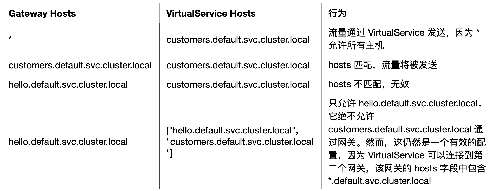

- # 至多包含两个不同字符串的最长子串 #[[alg/again]]
- [159. 至多包含两个不同字符的最长子串 - 力扣（LeetCode）](https://leetcode.cn/problems/longest-substring-with-at-most-two-distinct-characters/)
- 讲述了滑动窗口的大致解题思路
  https://leetcode.cn/problems/longest-substring-with-at-most-two-distinct-characters/solution/hua-dong-chuang-kou-zhen-di-jian-dan-yi-73bii/
- # 相隔为 1 的编辑举例 #[[alg/again]]
	- [161. 相隔为 1 的编辑距离 - 力扣（LeetCode）](https://leetcode.cn/problems/one-edit-distance/)
	- 这道题虽然写出来了，但是实现过程还可以再优雅一点。
- # 重建二叉树 #[[alg/again]]
	- [剑指 Offer 07. 重建二叉树 - 力扣（LeetCode）](https://leetcode.cn/problems/zhong-jian-er-cha-shu-lcof/)
	- 难度不大，但是这道题经常做到，会用到前序遍历、中序遍历、递归等知识点，可以多练习一次。
- # 单词的最大乘积 #[[alg/again]]
	- [剑指 Offer II 005. 单词长度的最大乘积 - 力扣（LeetCode）](https://leetcode.cn/problems/aseY1I/)
	- 优化点：将单词中的字幕字母映射到 0-25 的数字中，然后使用位与算法，可以计算出每个单词的值。如果两个单词的值进行 &，大于 0 则表示存在重复。
- # [[算法]]学习路径 #[[alg/schedule]]
	- **目标：**
		- 大多数数据结构的题都要做过，并且实现相应的数据结构。数组、链表、跳表、队列、栈、优先队列、二叉树、前缀树、并查集。
		- 了解常见的算法。比如 dfs、bfs、滑动窗口、单调栈、动态规划。
	- **资源：**
	- 剑指 offer（第 2 版）：https://leetcode.cn/problem-list/xb9nqhhg/
	- leetcode hot 100：https://leetcode.cn/problem-list/2cktkvj/
	- 程序员面试金典（第 6 版）：https://leetcode.cn/problem-list/xb9lfcwi/
- # 旋转数组最小值 #[[alg/again]]
	- [剑指 Offer 11. 旋转数组的最小数字 - 力扣（LeetCode）](https://leetcode.cn/problems/xuan-zhuan-shu-zu-de-zui-xiao-shu-zi-lcof/)
	- 算是二分法的变式。需要注意当 nums[mid] == nums[left] 时，是无法判断区间的，需要将 right = right - 1，在做判断。 为什么不能用 nums[mid] 和 nums[left]进行判断？因为当 nums[mid] > nums[left] 时并不能判断最小数在哪个区域，有歧义。 比如下面两个数组使用nums[mid] 和 nums[left] 进行判断结果是错误的：
	  [1,2,3,4,5]
	  [3,4,5,1,2]
	- 参考：
		- https://leetcode.cn/problems/xuan-zhuan-shu-zu-de-zui-xiao-shu-zi-lcof/solution/mian-shi-ti-11-xuan-zhuan-shu-zu-de-zui-xiao-shu-3/
- # 最长不含重复字符的字符串 #[[alg/again]]
	- [剑指 Offer 48. 最长不含重复字符的子字符串 - 力扣（LeetCode）](https://leetcode.cn/problems/zui-chang-bu-han-zhong-fu-zi-fu-de-zi-zi-fu-chuan-lcof/)
	- 通用方法是使用一个状态数组+快慢指针来解决。
- # 数组中出现次数超过一半的数字 #[[alg/again]]
	- [剑指 Offer 39. 数组中出现次数超过一半的数字 - 力扣（LeetCode）](https://leetcode.cn/problems/shu-zu-zhong-chu-xian-ci-shu-chao-guo-yi-ban-de-shu-zi-lcof/)
	- 这道题也可以用快速单边排序来做，但是使用摩尔投票法会更加地快速。
- # 二叉搜索树与双向链表 #[[alg/again]]
	- [剑指 Offer 36. 二叉搜索树与双向链表 - 力扣（LeetCode）](https://leetcode.cn/problems/er-cha-sou-suo-shu-yu-shuang-xiang-lian-biao-lcof/)
	- 中序遍历确定顺序，前后指针连接。
	- 参考：
		- https://leetcode.cn/problems/er-cha-sou-suo-shu-yu-shuang-xiang-lian-biao-lcof/solution/mian-shi-ti-36-er-cha-sou-suo-shu-yu-shuang-xian-5/
- # 二叉搜索树的后序遍历 #[[alg/again]]
	- [剑指 Offer 33. 二叉搜索树的后序遍历序列 - 力扣（LeetCode）](https://leetcode.cn/problems/er-cha-sou-suo-shu-de-hou-xu-bian-li-xu-lie-lcof/)
	- 主要是用到了分治的思想，把整棵树是否为二叉搜索树分割成左子树和右子树是否是二叉搜索树这两个子问题。
- # 栈的压入、弹出序列 #[[alg/again]]
	- [剑指 Offer 31. 栈的压入、弹出序列 - 力扣（LeetCode）](https://leetcode.cn/problems/zhan-de-ya-ru-dan-chu-xu-lie-lcof/)
	- 新建辅助栈，注意退出的边界条件。
- # 表示数值的字符串 #[[alg/again]]
	- [剑指 Offer 20. 表示数值的字符串 - 力扣（LeetCode）](https://leetcode.cn/problems/biao-shi-shu-zhi-de-zi-fu-chuan-lcof/)
	- 参考：
	  https://leetcode.cn/problems/biao-shi-shu-zhi-de-zi-fu-chuan-lcof/solution/mian-shi-ti-20-biao-shi-shu-zhi-de-zi-fu-chuan-y-2/
	- 可以看下状态机，以及评论里有一个用 c++实现的算法。注意边界条件。
- # 二进制中 1 的个数 #[[alg/again]]
	- [剑指 Offer 15. 二进制中1的个数 - 力扣（LeetCode）](https://leetcode.cn/problems/er-jin-zhi-zhong-1de-ge-shu-lcof/)
	- 这道题常规做法是循环，不过还可以通过 n & (n-1) 这个小技巧来快速找到 1 的个数。
	- 为什么这种算法行得通，得分两种情况讨论：
	  1. 低位是 1，那么 n&(n-1) = 0，去除了一个 1。
	  2. 低位为 0，那么 n-1，会把最近的一个 1 置为 0，然后后面 0 置为 1，n&(n-1)=0 结果不变。
	- 其实两种情况可以合并为一个结论：就是把最近的一个 1 置为，然后随后的 0 全部置为 1，结果 为 0。这样翻转 M（1 的个数），就能返回结果。
- # 数值的整数次方 #[[alg/again]]
	- [剑指 Offer 16. 数值的整数次方 - 力扣（LeetCode）](https://leetcode.cn/problems/shu-zhi-de-zheng-shu-ci-fang-lcof/)
	- 递归方法比较清晰，如何使用非递归去解决问题？
	  递归是采用回溯，那么如何使用循环去描述自底向下的过程。
- # 树的子结构 #[[alg/again]]
	- [剑指 Offer 26. 树的子结构 - 力扣（LeetCode）](https://leetcode.cn/problems/shu-de-zi-jie-gou-lcof/)
	- 改题目主要是使用了递归的思路。第一做了出来，但是解法比较耦合。新的解法将遍历 A 和判断 B 是否是 A 的子树这两个逻辑区分开发。更加直观。
- # 只出现一次的数字 #[[alg/again]]
	- [剑指 Offer II 004. 只出现一次的数字 - 力扣（LeetCode）](https://leetcode.cn/problems/WGki4K/)
	- 使用一个 64 长度的数组，存放每个数字的每位的值，因为只有一个元素出现过一次，其余都是 3 次，那么就可以对这个数组做 `arr[i] % 3` 的操作，拿到那个元素每一位的值，然后得出答案。
- # [[envoy]] 各种资源类型的解释
	- Envoy常见名词：
		- Downstream：请求 envoy 的对象。
		- Upstream：上游主机收到来自 Envoy 的连接请求同时相应该请求，类似 Kong 里面的 Target。
		- Cluster：一组逻辑上相似的上游主机。类似 Kong 里面的 Upstream。
		- Listener: 监听器。监听来自 4 层后者 7 层的流量。
		- Listener Filter：类似一个 pipeline 来处理数据。它的作用是在不更改 Envoy 的核心功能的情况下添加更多的集成功能
	- Envoy 配置包含四部分：
		- bootstrap：Envoy proxy 启动时加载的静态配置。
		- listeners：监听器相关配置，由 LDS 下发。
		- clusters： 包含动态和静态配置。动态配置由 CDS 下发。
		- routes：路由配置。包含动态和静态配置。动态配置有 RDS 下发。
	- 参考：
		- https://jimmysong.io/istio-handbook/data-plane/envoy-proxy-config-deep-dive.html
- # LATER 深入[[golang]] 定时器
	- 了解 golang的timer的常见用法，以及常见的坑，比如定时器泄漏
- # DONE 深入了解 [[golang]] 的sync.Pool
	- [[深入理解 golang 的 sync.Pool]]
	- 参考：
		- https://www.sobyte.net/post/2022-03/think-in-sync-pool/
		- https://www.qcrao.com/2020/04/20/dive-into-go-sync-pool/#pack-unpack （未读）
		- https://zhuanlan.zhihu.com/p/110140126 （未读）
- # [[golang]] 并发编程模式
	- 这边文章介绍了使用goroutine和channel实现常见并发编程case，比如模仿tee、并发worker、Fan-in/Fan-out。
	- 参考：
		- https://github.com/luk4z7/go-concurrency-guide
- # LATER [[HTTP]]方法解析
	- PUT、POST、GET 等方法的异同？ 哪些是幂等的？
	- 内部实现大概是怎么样的？？
	- POST 存在两次请求？
- # LATER [[istio]] 流量劫持过程 #[[servicemesh]]
	- https://jimmysong.io/blog/sidecar-injection-iptables-and-traffic-routing/
	  该文章介绍了istio-proxy如何劫持流量的详细过程。
# GetMesh是什么？ #servicemesh
	- Istio 的发布策略非常激进，正常企业不能这么快速完成变更、迭代。所以 GetMesh 做的事就是测试当前版本的 Istio 在多个 k8s 版本直接的兼容性，并且会针对 Istio 打上所需的安全或者错误修复的补丁更新。简单来说比上游提供更稳定的支持。
- # [[istio]] 中的发现选择器 #[[servicemesh]]
- 在常规配置中，Istio 会观察 k8s 所有资源的更新。也就是说，一个服务的更新，会把这次更新下发到所有命令空间的 sidecar 中。当 Mesh 扩大后这种问题会严重拖慢性能，所以在 Istio 1.10 中引入了发现选择器。它允许我们控制 Istio 平面观察和发送配置更新的命名空间。
- # [[istio]] 中 VirtualService 和 Gateway 的联系
- 两者都有 host 字段用来匹配 host。如果 VirtualService 中定义的host 没有包含在某个 Gateway 中，那么就会继续找下一个 Gateway。直到找到合适，否则会返回404（已验证过）。
- 下图举例说明了这种关系：
- 
- # LATER 理解[[js]]中的箭头函数
	- 参考：
		- https://developer.mozilla.org/en-US/docs/Web/JavaScript/Reference/Functions/Arrow_functions
- # npm 与 npx #[[nodejs]]
	- npx是 npm5.2 之后带的一个命令，主要提供了一下功能：
		- 调用项目安装的模块。有时候一些二进制文件在node_modules/.bin中，我们不能直接调用，需要指定路径或者在 package.json 中的 scripts 中指定。有了 npx，我们就可以这样调用：npx mocha --version（mocha 是一个测试工具）。npx 回到 node_modules/.bin 和 $PATH 中去找命令，找到了就执行。
		- 避免全局安装模块。有时候我们会使用 create-react-app 这个模模块。 执行 npx create-react-app my-react-app 时，会将 create-react-app 下载到一个临时目录中，执行完成后再删除，每次执行都会重新下载。
	- 参考：
		- https://www.ruanyifeng.com/blog/2019/02/npx.html
- # 什么是受控组件 #[[react]]
	- 因为 Square 组件不再持有 state，因此每次它们被点击的时候，Square 组件就会从 Board 组件中接收值，并且通知 Board 组件。在 React 术语中，我们把目前的 Square 组件称做“受控组件”。在这种情况下，Board 组件完全控制了 Square 组件。
- # [[k8s]] 全限定域名（FQDN）
	- k8s 中使用 DNS 来做服务发现，具体规则就是 Service Name + Namespace + Cluster domain。
	- 假如一个 Service 为 rating，namespace 为 prd，那么使用 rating 只能在本 Namespace 使用，而使用rating.prd，整个集群都可以使用。
	- rating 的 DNS name 最终会被扩展为 rating.prd.svc.cluster.local。其中 svc.cluster.local 是 default cluster domain，你也可以自己指定。
	- 至于怎么扩展的，在主机的 resolv.conf 有定义，例如：
		- ```plainText
		  nameserver 10.32.0.10
		  search <namespace>.svc.cluster.local svc.cluster.local cluster.local
		  options ndots:5
		  ```
	- 如果你在 /etc/resolv.conf 中配置了 search baidu.com。 然后命令行调用 ping news，它首先会去解析 news 这个域名存不存在，如果不存在，那么就会使用 search 的选项， 拼接一个新的 news.baidu.com，然后再去进行查询。
	- 参考：
		- [the resolv.conf manual page](https://www.man7.org/linux/man-pages/man5/resolv.conf.5.html)
		- [resolv.conf 中 search 的作用](https://superuser.com/questions/570082/in-etc-resolv-conf-what-exactly-does-the-search-configuration-option-do)
		- [k8s 基于 DNS 服务发现的设计文档](https://github.com/kubernetes/dns/blob/master/docs/specification.md#1---schema-version)
- # [[k8s]] 资源对象参考文档
	- 介绍了各种资源对象，以及对应参数的意义。
	- [Kubernetes API Reference Docs](https://kubernetes.io/docs/reference/generated/kubernetes-api/v1.24/#-strong-api-overview-strong-)
# k8s service
	- **service 模式：**
		- service 类型：
			- clusterIP又可以分为两种服务：
				- service
				- headless service。一般配合 statefulset 可以访问到某个特定的 pod。
			- nodePort
			- externalName
			- loadBalancer
		- 创建一个 service 有两个模块一起工作。
			- controller(serviceController, endpointController)会创建对应的资源对象。比如 service 和 endpoint。
			- kube-proxy 会将 service 和 endpoint 中的信息同步到 iptables 和 ipvs 中。
		- serviceController 通过 Informer 监听 service 资源的增删，来创建 service。而 endpointController 没有通过 Informer 监听 endpoint 资源的改动。但是它订阅了 service 和 pod 资源的改动。
		- 每一个 kube-proxy 在节点启动时都会创建一个 ServiceConfig 对象，用来接收 Service 的变更。每当有变更事件时，都会通过 ServiceConfig、EndPointConfig 推送给 Proxier（kube-proxy组件），Proxier 再将这些规则应用到 ipvs 或者 iptables 中。
	- **ipvs 和 iptables 的区别：**
		- iptables 在规则变多之后，增删会非常耗时。ipvs 使用hash数据结构则不会。
		- ipvs 支持多种复杂策略：最小连接、轮询、源地址 hash、最小延时等；在规则变多之后增删的性能也趋向稳定。
	- **service 流量转发原理（iptables 模式）：**
		- 首先会在 iptables 中创建一条链，如下：
			- ```sh
			  -A KUBE-SERVICES -d 10.0.1.175/32 -p tcp -m comment --comment "default/hostnames: cluster IP" -m tcp --dport 80 -j KUBE-SVC-NWV5X2332I4OT4T3
			  ```
			  大概意思就是目的地址是10.0.1.175/32，目标端口是 80 的请求都转发到KUBE-SVC-NWV5X2332I4OT4T3这条链。
		- KUBE-SVC-NWV5X2332I4OT4T3这条链也有很多规则，如下：
			- ```sh
			  -A KUBE-SVC-NWV5X2332I4OT4T3 -m comment --comment "default/hostnames:" -m statistic --mode random --probability 0.33332999982 -j KUBE-SEP-WNBA2IHDGP2BOBGZ
			  -A KUBE-SVC-NWV5X2332I4OT4T3 -m comment --comment "default/hostnames:" -m statistic --mode random --probability 0.50000000000 -j KUBE-SEP-X3P2623AGDH6CDF3
			  -A KUBE-SVC-NWV5X2332I4OT4T3 -m comment --comment "default/hostnames:" -j KUBE-SEP-57KPRZ3JQVENLNBR
			  ```
			  这一步在 iptables 上开启了负载均衡，使用轮询方式访问 pod，然后使用--probability设置权重，最后通过-j xxx 跳转到不同的链上面。
		- 指定一条跳转的链：KUBE-SEP-57KPRZ3JQVENLNBR
			- ```sh
			  -A KUBE-SEP-57KPRZ3JQVENLNBR -s 10.244.3.6/32 -m comment --comment "default/hostnames:" -j MARK --set-xmark 0x00004000/0x00004000
			  -A KUBE-SEP-57KPRZ3JQVENLNBR -p tcp -m comment --comment "default/hostnames:" -m tcp -j DNAT --to-destination 10.244.3.6:9376
			  ```
			  主要看第二条 DNAT 的链，它将 clusterIP 替换成了真实地 pod 地址。这也是为什么我们用 ping工具，ping 不通clusterIP。
	- 参考：
		- [Kubernetes教程(五)---Service 的几种访问方式 | 指月小筑|意琦行的个人博客 (lixueduan.com)](https://www.lixueduan.com/post/kubernetes/05-service-access/)
		- [Kubernetes教程(四)---Service核心原理 | 指月小筑|意琦行的个人博客 (lixueduan.com)](https://www.lixueduan.com/post/kubernetes/04-service-core/)
		- [详解 Kubernetes Service 的实现原理 - 面向信仰编程 (draveness.me)](https://draveness.me/kubernetes-service/)
- # LATER 学习 [[golang]] 的开源库 wire 和 ent
	- wire 是 google 的开源库，实现了依赖注入。
	- ent 是 facebook 开源的库。
	- 两者实现都比较优雅，可以看下。
- # 关于如何使用 [[logseq]]的视频分享
	- [(2251) 我是如何使用 Logseq 的 | How do I use Logseq - YouTube](https://www.youtube.com/watch?v=DxoGJBb1mWQ)
- # LATER [[python]]中with open() as f 的原理
	- 传统的`open`函数只能够打开，如果你需要在异常时close，需要使用 `try/except/finally` 语法。而使用了`with open(...) as f`的语法可以保证在退出 with 这个作用域时自动帮你释放文件句柄。如下两端代码：
		- ```python
		  with open('hello.txt', encoding='utf-8') as f:
		    for line in f:
		      print(line)
		  ```
	-